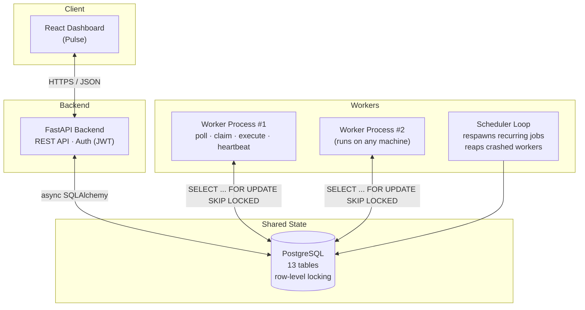
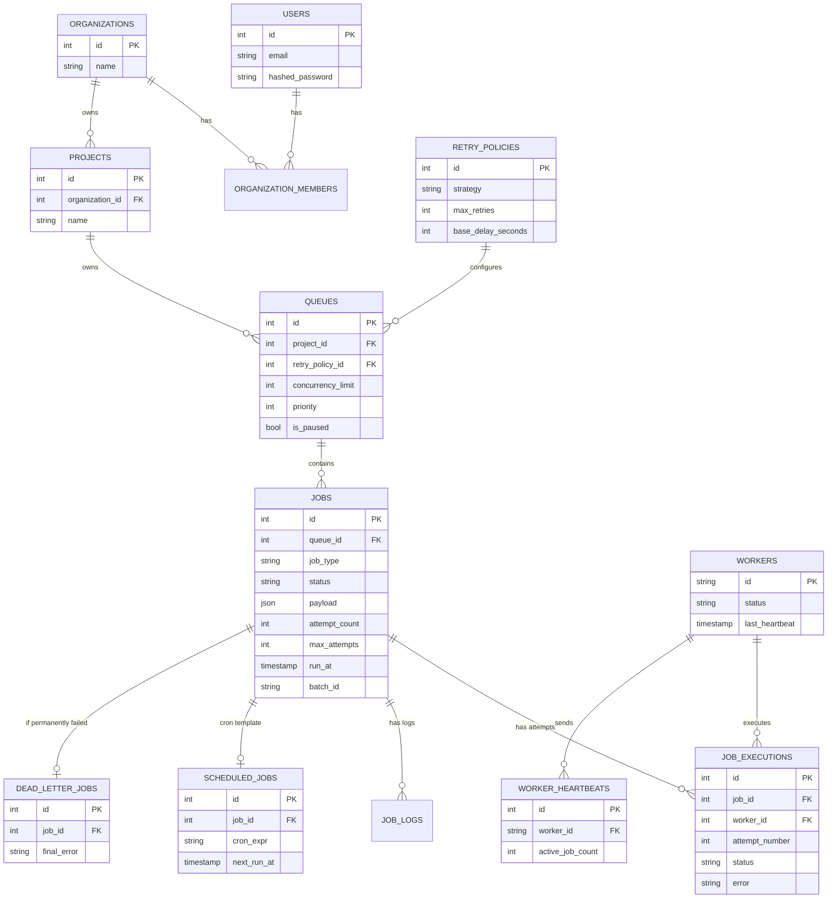

# Pulse — Distributed Job Scheduler

A backend system that lets applications hand off background work (sending emails, processing images, generating reports, retrying failed payments) to a pool of workers that execute it **reliably** — without duplicating work, without losing track of failures, and without silently getting stuck if something crashes.

Built for the Codity.ai backend engineering internship assignment.

---

## The problem, in one paragraph

Real apps have work that's too slow to do while a user waits — like sending a confirmation email or resizing an uploaded photo. Instead of doing it immediately, that work gets dropped into a queue, and separate background "workers" pick it up and finish it. The hard part isn't the happy path — it's making sure two workers never grab the same job twice, failed jobs get retried sensibly instead of retried forever, and a crashed worker's unfinished work doesn't vanish. This project solves exactly that.

---

## What we built

- **Auth + Projects + Queues** — organize background work by project, configure priority/concurrency/pause per queue
- **5 job types** — immediate, delayed, scheduled, recurring (cron), and batch — all created through REST APIs
- **A worker service** that polls queues, **atomically claims** jobs (no duplicate execution, even with multiple workers running at once), executes them concurrently, sends heartbeats, and shuts down gracefully
- **Retries with 3 strategies** — fixed delay, linear backoff, exponential backoff — configurable per queue
- **Dead Letter Queue** — jobs that exhaust all retries get parked here with their error, ready to be inspected and replayed
- **Full execution history** — every attempt is logged with timestamps, worker ID, and error details
- **A live dashboard** (React) — manage queues, browse jobs, monitor workers, replay dead jobs
- **AI failure analysis (bonus)** — every dead job gets an automated diagnosis. Tries a real Gemini API call first; if that's unavailable for any reason, falls back instantly to a built-in rule-based analyzer, so the feature never visibly breaks

---

## Architecture



**Key idea:** the API and the workers never talk to each other directly — they only ever talk to Postgres. This means workers can be added, removed, or restarted at any time without touching the API, and vice versa. The database is the single source of truth.

---

## Database schema



**Why one `jobs` table for 5 job types?** Instead of 5 separate tables, all job types share one table with a `job_type` column. This keeps the worker's claim query — the single most frequently run query in the whole system — simple and backed by one index, instead of checking 5 tables every poll.

**The most important index:**
```sql
CREATE INDEX ix_jobs_claim ON jobs (queue_id, status, priority, run_at, created_at);
```
This matches exactly what the worker's claim query filters and sorts by, so Postgres never needs a full table scan to find the next job.

---

## How a job actually gets processed (the core mechanism)

```sql
SELECT * FROM jobs
WHERE status = 'queued' AND queue_id = :q AND (run_at IS NULL OR run_at <= now())
ORDER BY priority DESC, created_at
FOR UPDATE SKIP LOCKED
LIMIT :batch_size;
```

`FOR UPDATE` locks the rows a worker is about to claim. `SKIP LOCKED` means if another worker already locked a row, this worker skips it instead of waiting — so 10 workers can poll at the same instant and each walks away with a *different* job. Zero duplicate execution, zero workers blocked waiting on each other.

**Job lifecycle:**
```
queued/scheduled → claimed → running → completed
                                     ↳ failed → (retries left?) → queued (after backoff delay)
                                              ↳ (no retries left) → dead (Dead Letter Queue)
```

---

## Tech stack

| Layer | Choice | Why |
|---|---|---|
| Backend | FastAPI (async Python) | Native async fits both the API and the worker's concurrency model |
| Database | PostgreSQL | `SELECT ... FOR UPDATE SKIP LOCKED` — the cleanest way to do safe concurrent job claiming |
| ORM | SQLAlchemy (async) + asyncpg | First-class async support |
| Auth | JWT | Stateless, keeps the API horizontally scalable |
| Worker concurrency | `asyncio.Semaphore` per queue | Enforces each queue's concurrency limit |
| Recurring jobs | `croniter` | Correct cron-expression math |
| Frontend | React + Vite + Tailwind | Fast to build, small enough not to need more |
| AI failure analysis | Rule-based pattern matcher | Zero cost, zero latency, fully explainable, never fails during a demo |

---

## Project structure

```
├── backend/          FastAPI app, worker process, database schema, tests
├── frontend/         React dashboard
└── docs/             Design document, diagrams
```

## Running it

Full step-by-step instructions (including troubleshooting) are in `backend/README.md` and `frontend/README.md`. Quick version:

```bash
# 1. Create a Postgres database and run backend/schema.sql against it
# 2. Backend
cd backend
cp .env.example .env   # fill in your DB password
pip install -r requirements.txt
uvicorn app.main:app --reload

# 3. Worker (separate terminal)
python -m app.worker

# 4. Frontend (separate terminal)
cd frontend
npm install
npm run dev
```

Then open `http://localhost:5173`.

## Testing

```bash
pytest backend/tests/test_retry.py -v          # retry math, no DB needed
pytest backend/tests/test_concurrency.py -v    # needs a real Postgres DB — proves 10 racing
                                                 # workers never double-claim one job
```

## What's honestly not implemented

Workflow dependencies (DAGs), queue sharding, rate limiting, and role-based access control were considered out of scope given the timeline. The full reasoning for these and every other design trade-off is in `docs/` — including why polling was used instead of WebSockets, why job types share one table, and why the AI feature has a rule-based fallback rather than being fully dependent on an external API.
